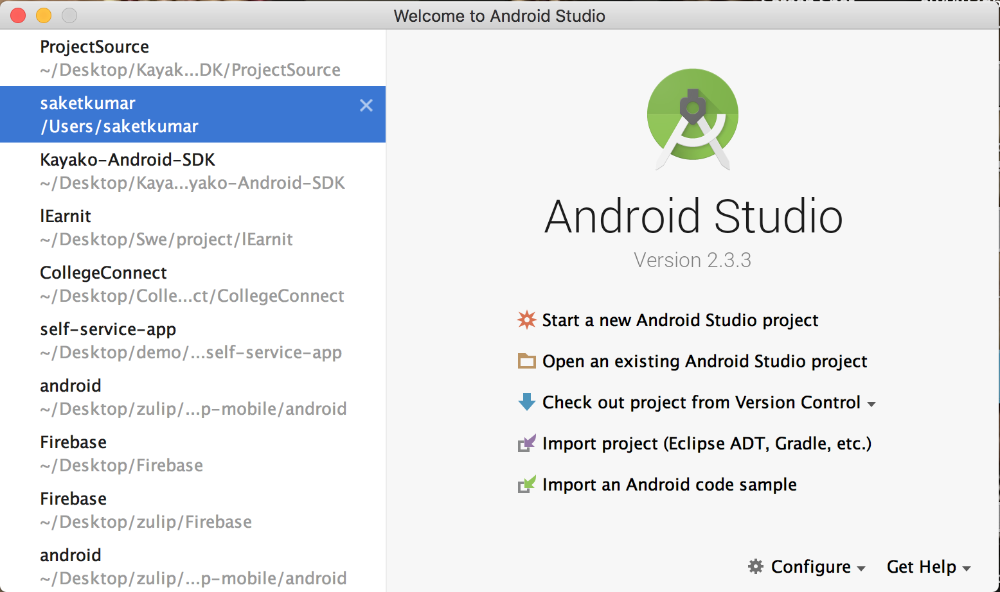
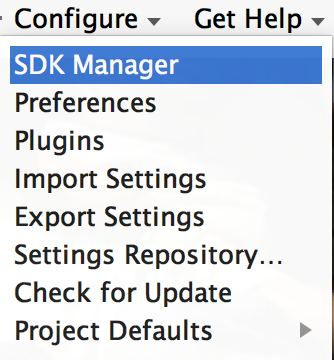
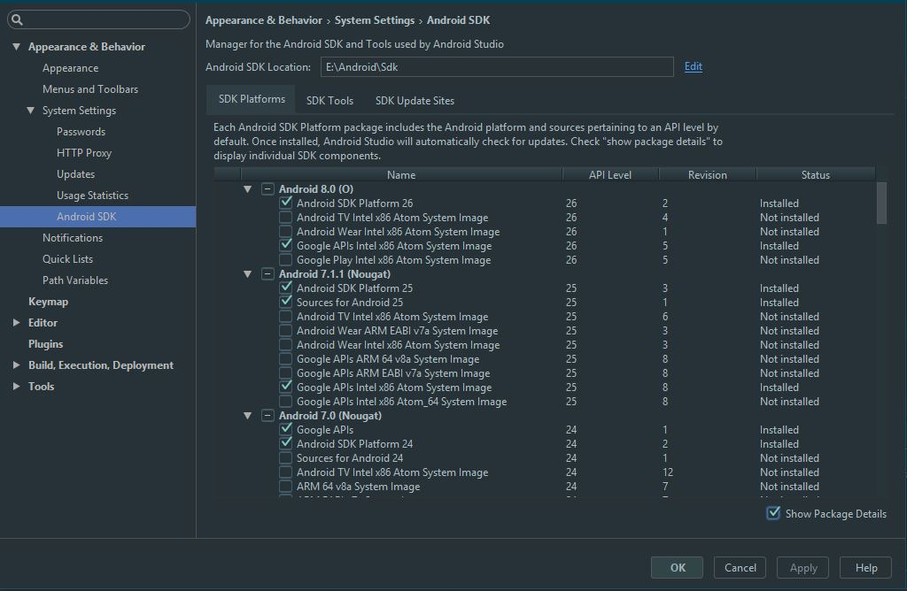

# Android Studio Installation

## Why Android development?

There are over 1 billion android devices active and 2.2 millions android apps on play store today.Android represents an incredible opportunity for developers. Also Android studio is a latest and most widely used IDE designed by Google itself.So if you want to develop apps in android then it is highly recommended to use Android Studio.

## Quick Overview

An android app is written in XML for the frontend UI and JAVA for the backend.

All the backend part is done using Java. But now, Kotlin Language is declared for Official by Google for Android development.Although it’s not a big deal to switch to Kotlin as If you know any object oriented programming language, then it will not be much difficult to relate to the concepts used during development. In short if you know C++ then also you are at peace.

The frontend part is done using XML. All user interface elements in an Android app are built using View and ViewGroup objects. 

## Installation of Android Studio

JDK and JRE are essential for JAVA to run on your machine.

### For Linux Users :

#### Installing JAVA : 

Open up your Terminal ( Alt + Shift + T) and follow the below commands to install JDK and JRE.

### Step 1: Update package list

`sudo apt-get update`

### Step 2: Install JRE and JDK

`sudo apt-get install default-jre  default-jdk  oracle-java8-installer`

### Step 3: Configure Java

`sudo update-alternatives --config java`

### Step 4: Set environment variable replacing YOUR_PATH with path which last command returned

`sudo vim /etc/environment – add JAVA_HOME="YOUR_PATH"`

### Step 5:

`source /etc/environment`

Visit this [link](https://www.digitalocean.com/community/tutorials/how-to-install-java-on-ubuntu-with-apt-get) for any reference.

## Installing IDE

1. Follow this [link](https://developer.android.com/studio/index.html) and select all the packages for linux. This will download the zip file.

2. Extract the file.

3. In terminal type: 
`cd /{Location where you extracted the zip file}/android-studio/bin` and then `sh studio.sh`

This will open up the android studio. Somewhat similar to below would appear. Select configure in it.

Click on the SDK Manager icon 

Now the below window will appear. Install the ticked packages shown in the below image.

